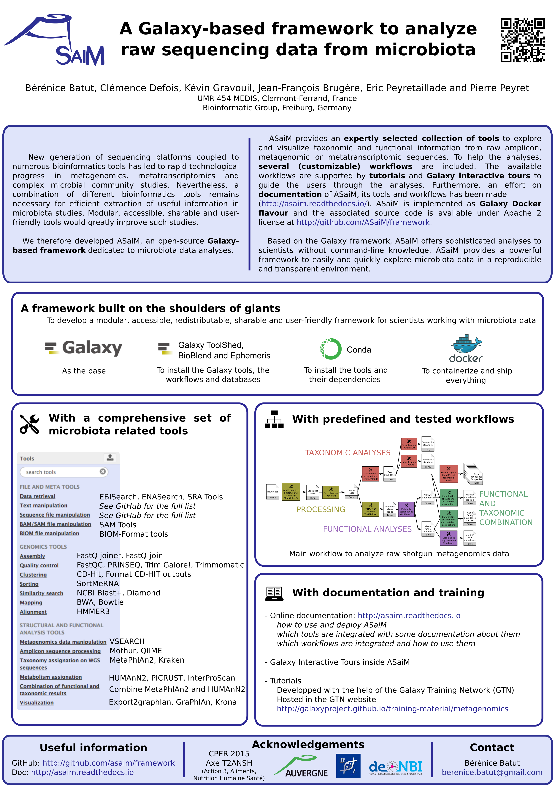

A Galaxy-based framework to analyze raw sequencing data from microbiota
=======================================================================

### Bérénice Batut, Clémence Defois, Kévin Gravouil, Jean-François Brugère, Eric Peyretaillade and Pierre Peyret

*Poster presented at the [Galaxy Community Conference 2017](https://gcc2017.sciencesconf.org/)*

### Abstract

New generation of sequencing platforms coupled to numerous bioinformatics tools has led to rapid technological progress in metagenomics, metatranscriptomics and complex microorganism communities’ studies. Nevertheless, a combination of different bioinformatics tools remains necessary for efficient extraction of useful information in microbiota studies. Modular, accessible and sharable user-friendly tools would greatly improve such studies. We therefore developed ASaiM, an open-source Galaxy-based framework dedicated to microbiota data analyses.

ASaiM provides an expertly selected collection of tools to exploit and visualize taxonomic and functional information from raw amplicon, metagenomic or metatranscriptomic sequences. To help the analyses, several (customizable) workflows are included. The main workflow has been tested on two mock metagenomic datasets with controlled communities. More accurate and precise taxonomic analyses and more informative metabolic description have been obtained compared to EBI metagenomics’ pipeline on the same datasets.

The available workflows are supported by tutorials and Galaxy interactive tours to guide the users through the analyses. Furthermore, an effort on documentation of ASaiM, its tools and workflows has been made ([http://asaim.readthedocs.io/](http://asaim.readthedocs.io/)). 
 
Based on the Galaxy framework, ASaiM offers sophisticated analyses to scientists without command-line knowledge. It can be easily extended with additional tools or workflows and easily deployed: ASaiM is implemented as Galaxy Docker flavour. ASaiM provides then a powerful framework to easily and quickly exploit microbiota data in a reproducible and transparent environment.

