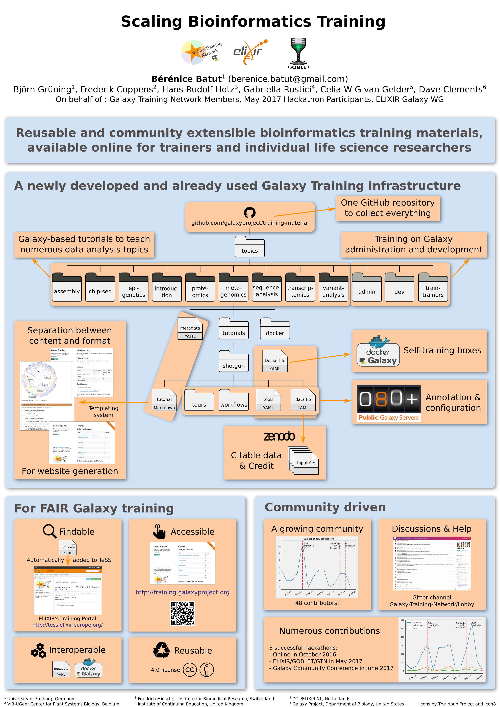

Scaling Bioinformatics Training: An ELIXIR, GOBLET & Galaxy Training Network Collaboration
==========================================================================================

### Bérénice Batut, Björn Grüning, Frederik Coppens, Hans-Rudolf Hotz, Gabriella Rustici, Celia W G van Gelder, Dave Clements

On behalf of : Galaxy Training Network Members, May 2017 Hackathon Participants, ELIXIR Galaxy WG

*Poster presented at [ISMB/ECCB](https://www.iscb.org/ismbeccb2017)*

### Abstract

Scalability is a key challenge in bioinformatics. Data management, analysis pipelines, compute infrastructure, visualisations, and training must all scale to address ever-larger experimental designs, and the increasing prevalence of data-intensive life science research. [ELIXIR](https://www.elixir-europe.org/), [GOBLET](http://www.mygoblet.org/), and the [Galaxy Training Network (GTN)](https://galaxyproject.org/teach/gtn/) have teamed up to create reusable and community extensible bioinformatics training materials, [available online](https://galaxyproject.github.io/training-material/) for individual life science researchers and trainers.

Thanks to this community led effort, a series of Galaxy-based tutorials were developed to teach numerous data analysis topics, ranging from genomics to proteomics to metabolomics. Training on Galaxy administration and development is also included in this effort. The content is developed in Markdown, stored in [GitHub](https://github.com/galaxyproject/training-material) and separated from the presentation on the website, facilitating its development and updating by the community. The technological infrastructure needed to teach is provided with Docker images for each topic and the datasets are stored in Zenodo with assigned DOIs. All materials are annotated by a rich set of metadata and automatically propagated to ELIXIR’s TeSS portal. This approach creates tutorials that are accessible, easy to find and use (FAIR) by individuals and by trainers for workshops.

This poster highlights the approach taken, how it addresses the scalability of presenting, creating, and maintaining training materials, as well as the resulting products.  We will also report on the the recently held [ELIXIR/GOBLET/GTN hackathon](https://docs.google.com/document/d/1dLCL5-2pkWTvmGTz7GyQkb5LEIZ3FBkPvCBoqUPGUOg/edit) for Galaxy training material re-use and the community’s future plans.
