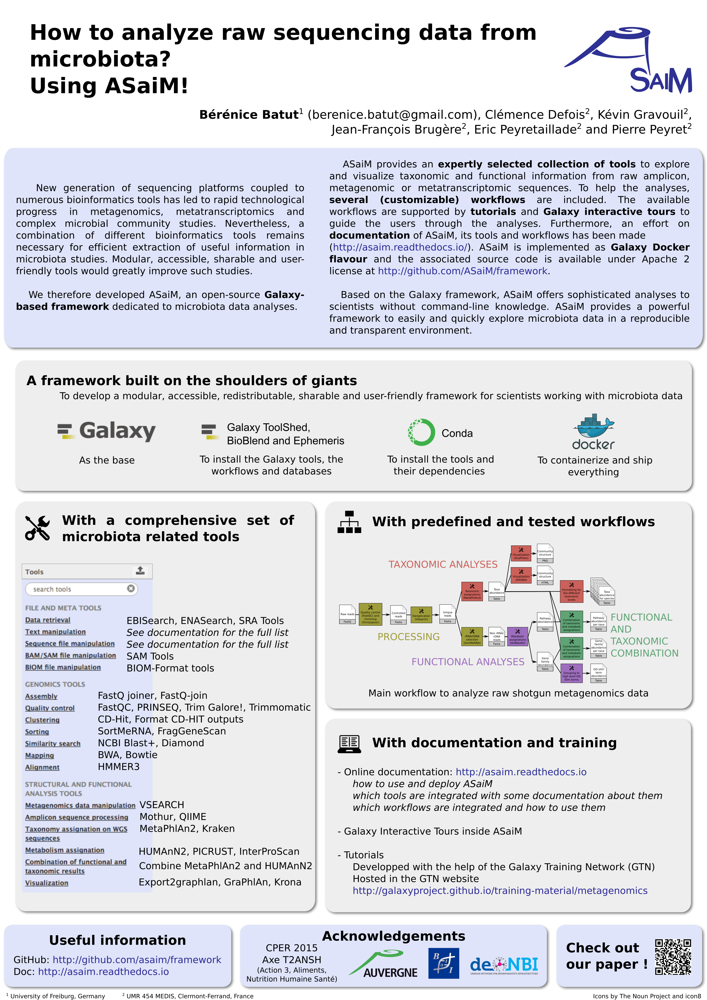

How to analyze raw sequencing data from microbiota? Using ASaiM!
================================================================

### Bérénice Batut, Clémence Defois, Kévin Gravouil, Jean-François Brugère, Eric Peyretaillade and Pierre Peyret

*Poster presented at [GCB 2017](http://www.gcb2017.de/)*

