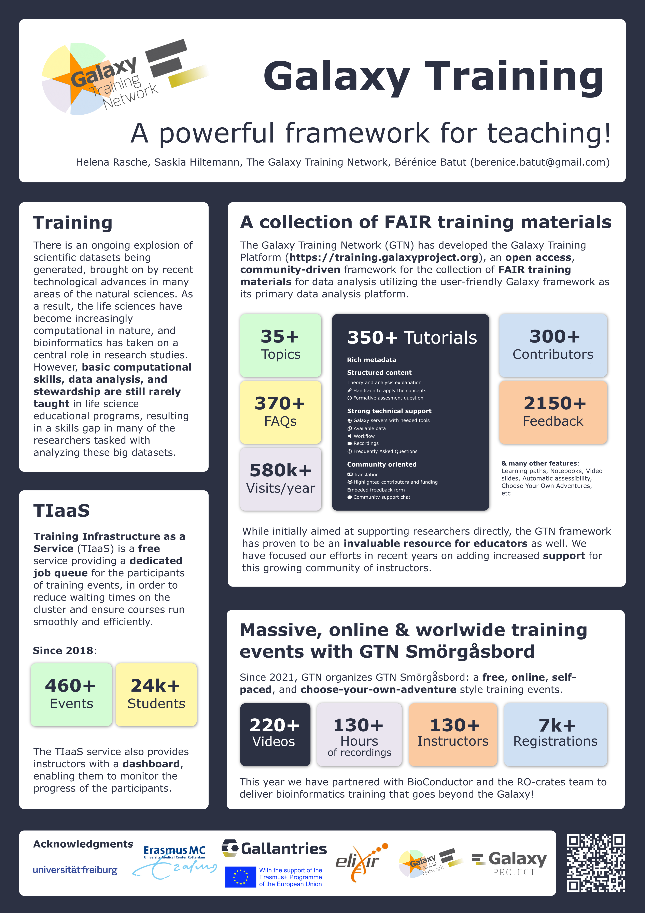

Galaxy Training: A powerful framework for teaching!
===================================================

### Helena Rasche, Saskia Hiltemann, The Galaxy Training Network, Bérénice Batut

*Poster presented at [ELIXIR All Hands Meeting 2023](https://elixir-europe.org/events/elixir-all-hands-2023) and [ISMB 2023](https://www.iscb.org/ismbeccb2023)*

## Abstract

There is an ongoing explosion of scientific datasets being generated, brought on by recent technological advances in many areas of the natural sciences. As a result, the life sciences have become increasingly computational in nature, and bioinformatics has taken on a central role in research studies. However, basic computational skills, data analysis, and stewardship are still rarely taught in life science educational programs, resulting in a skills gap in many of the researchers tasked with analyzing these big datasets.

In order to address this skills gap and empower researchers to perform their own data analyses, the Galaxy Training Network (GTN) has previously developed the [Galaxy Training Platform](https://training.galaxyproject.org), an open access, community-driven framework for the collection of FAIR (Findable, Accessible, Interoperable, Reusable) training materials for data analysis utilizing the user-friendly Galaxy framework as its primary data analysis platform. 

Since its inception, this training platform has thrived, with the number of tutorials and contributors growing rapidly, and the range of topics extending beyond life sciences to include topics such as climatology, cheminformatics, and machine learning. 

While initially aimed at supporting researchers directly, the GTN framework has proven to be an invaluable resource for educators as well. We have focused our efforts in recent years on adding increased support for this growing community of instructors. New features have been added to facilitate the use of the materials in a classroom setting, simplifying the contribution flow for new materials, and have added a set of train-the-trainer lessons.

## Useful links

- [Galaxy Training Network](https://training.galaxyproject.org)
    - [Galaxy Training Video Library](https://gallantries.github.io/video-library/library)
    - [Course Builder](https://gallantries.github.io/video-library/course-builder)
    - [Paper "Galaxy Training: A powerful framework for teaching!"](https://journals.plos.org/ploscompbiol/article?id=10.1371/journal.pcbi.1010752)
- Training Infrastructure as a Service
    - [On Galaxy Europe](https://usegalaxy.eu/tiaas/)
    - [On Galaxy Org](https://usegalaxy.org/tiaas/)
    - [On Galaxy Australia](https://usegalaxy.org.au/tiaas/)
- GTN Smörgåsbord
    - [Smörgåsbord 2023](https://gallantries.github.io/video-library/events/smorgasbord3/)
    - [Smörgåsbord 2022](https://gallantries.github.io/video-library/events/smorgasbord2/tapas.html)
- [Galaxy Community Hub](https://galaxyproject.org/)
- [Gallantries](https://gallantries.github.io/)
- Social media
    - Twitter
        - [@galaxyproject](https://twitter.com/galaxyproject)
        - [@gxytraining](https://twitter.com/gxytraining)
        - [@Gallantries_EU](https://twitter.com/Gallantries_EU)
    - Mastodon
        - [@galaxyproject@mstdn.science](https://mstdn.science/@galaxyproject)
        - [@gtn@mstdn.science](https://mstdn.science/@gtn)
        - [@gallantries@mstdn.science](https://mstdn.science/@gallantries)

## Poster

