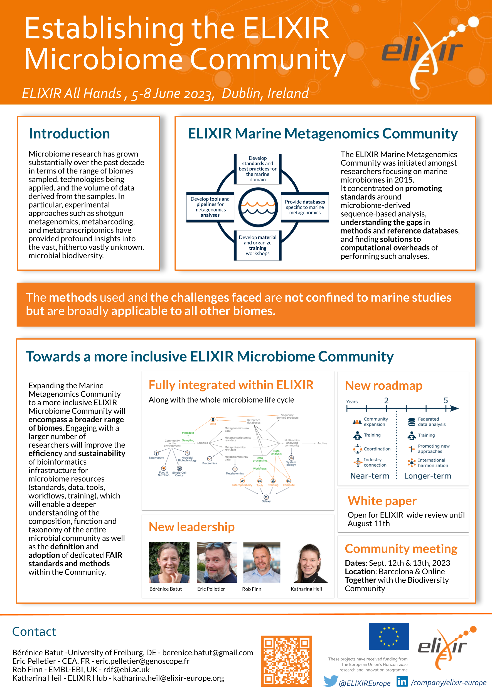

Establishing the ELIXIR Microbiome community 
============================================

### Bérénice Batut, Eric Pelletier, Robert Finn

*Poster presented at [ELIXIR All Hands Meeting 2023](https://elixir-europe.org/events/elixir-all-hands-2023)*

## Abstract

Microbiome research has grown substantially over the past decade in terms of the range of biomes sampled, taxa identified, and the volume of sequence data derived from the samples. In particular, experimental approaches such as shotgun metagenomics, metabarcoding, and metatranscriptomics have provided profound insights into the vast, hitherto vastly unknown, microbial biodiversity. 
The ELIXIR Marine Metagenomics Community, initiated amongst researchers focusing on marine microbiomes, concentrated on promoting standards around microbiome-derived sequence-based analysis, understanding the gaps in methods and reference databases, and finding solutions to computational overheads of performing such analyses. Nevertheless, the methods used and the challenges faced are not confined to marine studies but are broadly applicable to all other biomes. 
Thus, expanding this Community to a more inclusive ELIXIR Microbiome Community will encompass a broad range of biomes. Furthermore, engaging with a larger number of researchers will improve the efficiency and sustainability of bioinformatics infrastructure for microbiome resources (standards, data, tools, workflows, training), which will enable a deeper understanding of the composition, function and taxonomy of the entire microbial community as well as the definition and adoption of dedicated FAIR standards and methods within the Community.

This poster will describe the various activities that the ELIXIR Marine Metagenomics Community has undertaken towards the transition to a broader Microbiome community. We will outline the proposed roadmap, highlighting how we see this new community fitting with the other ELIXIR communities and platforms.

## Links

- [White paper](https://drive.google.com/file/d/1HvqUMJo7H1cbd2uwh0qZP5in45uqFtLo/view?usp=sharing) - Open for ELIXIR wide review until August 11th

- Community Meeting in Barcelona
    - Registration
    - Agenda

## Poster

