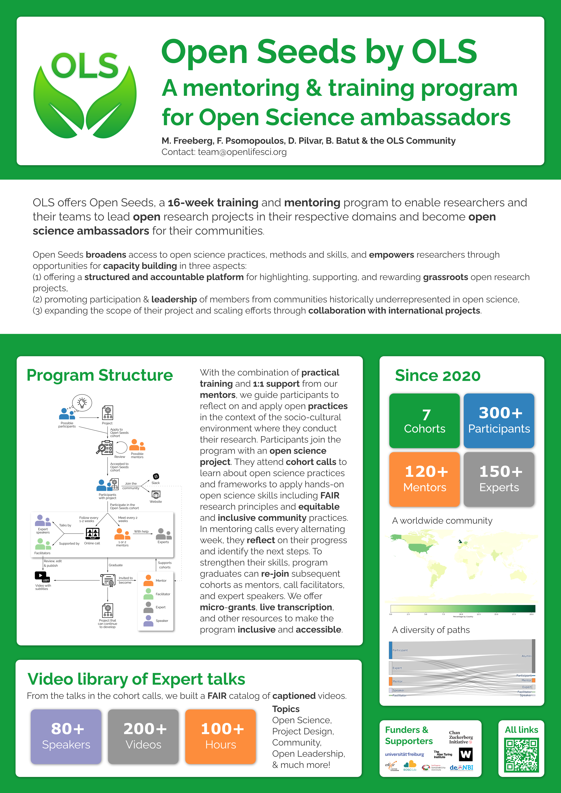

Open Life Science: A mentoring & training program for Open Science ambassadors
==============================================================================

### Mallory Freeberg, Fotis Psomopoulos, Diana Pilvar, Bérénice Batut

*Poster presented at [ELIXIR All Hands Meeting 2023](https://elixir-europe.org/events/elixir-all-hands-2023) and [ISMB 2023](https://www.iscb.org/ismbeccb2023)*

## Abstract

Open Life Science (OLS) offers 16-week training and mentoring programs to enable researchers and their teams to lead open research projects in their respective domains and become open science ambassadors for their communities. 
With the combination of practical training and 1:1 support from our mentors, we guide participants to reflect on and apply open practices in the context of the socio-cultural environment where they conduct their research. Participants join the program with an open science project. They attend cohort calls to learn about open science practices and frameworks to apply hands-on open science skills including FAIR research principles and equitable and inclusive community practices. In mentoring calls every alternating week, they reflect on their progress and identify the next steps. To strengthen their skills, program graduates can re-join subsequent cohorts as mentors, call facilitators, and expert speakers. We offer micro-grants, live transcription, and other resources to make the program inclusive and accessible.

Since 2020, we have run 7 cohorts and trained >300 participants from 6 continents, across 50+ low- and middle- (LMICs), and high-income countries (HICs), with the help of 120+ mentors and 150+ experts.

This poster will describe the various aspects of the program and highlight all materials (including speaker deck, recorded videos, assignment materials, and organisational processes) that are shared openly utilising FAIR practices.

## Poster

