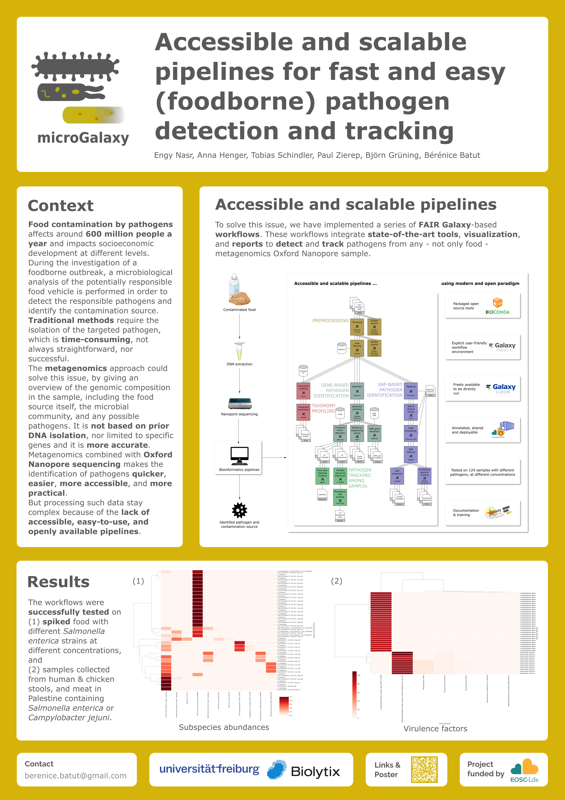

Accessible and scalable pipelines for fast and easy (foodborne) pathogens detection and tracking
================================================================================================

### Engy Nasr, Anna Henger, Tobias Schindler, Björn Grüning, Bérénice Batut

*Poster presented at [ELIXIR All Hands Meeting 2023](https://elixir-europe.org/events/elixir-all-hands-2023)*

## Abstract

Food contamination by pathogens affects around 600 million people a year and impacts socioeconomic development at different levels.
During the investigation of a foodborne outbreak, a microbiological analysis of the potentially responsible food vehicle is performed in order to detect the responsible pathogens and identify the contamination source. Traditional methods require the isolation of the targeted pathogen, which is time-consuming, not always straightforward, nor successful. The metagenomics approach could solve this issue, by giving an overview of the genomic composition in the sample, including the food source itself, the microbial community, and any possible pathogens. It is not based on prior DNA isolation, nor limited to specific genes and it is more accurate.
Metagenomics combined with Oxford Nanopore sequencing makes the identification of pathogens quicker,  easier, more accessible, and more practical. But processing such data stay complex because of the lack of accessible, easy-to-use, and openly available pipelines.

To solve this issue, we have implemented a series of FAIR Galaxy-based workflows.
These workflows integrate state-of-the-art tools, visualization, and reports to detect and track pathogens from any - not only food - metagenomics Oxford Nanopore sample.
The workflows were successfully tested on (1) spiked food with different Salmonella enterica strains at different concentrations, and (2) samples collected from humans, meat, and chicken in Palestine containing Campylobacter jejuni.

The workflows are available on the European Galaxy server, but also on EOSC-Life WorkflowHub. They are annotated and documented as an e-learning tutorial available on Galaxy Training Network.

## Links

- 

## Poster

