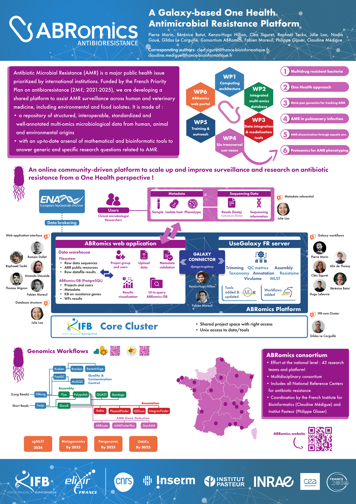

ABRomics: a Galaxy-based One Health Antimicrobial Resistance Platform
=====================================================================

### Pierre Marin, Bérénice Batut, Kenzo-Hugo Hillion, Cléa Siguret, Raphaël Tackx, Julie Lao, Nadia Goué, Gildas Le Corguillé, Consortium ABRomics, Fabien Mareuil, Philippe Glaser, Claudine Médigue

*Poster presented at [Galaxy Community Conference 2024](https://galaxyproject.org/events/gcc2024/)*

## Abstract

Antibiotic resistance (ABR) is a major global public health issue designated for urgent action by international institutions, especially regarding the emergence and the global dissemination of multidrug-resistant bacteria (MDRB) and antibiotic resistance genes (ARGs) carried by mobile genetic elements. They are widely transmitted between humans, animals, and the environmental domains, without borders, calling for a One Health perspective on ABR.

Whole genome sequencing (WGS) is used for molecular typing purposes at the highest resolution. It provides the genome sequences required for the identification of ARGs as well as mutations leading to a decrease in antibiotic susceptibility. Tracking transmissions of outbreaks and identifying sources of contamination is achievable with WGS data combined with epidemiological information. Ensuring the sharing of high-quality sequence data alongside interoperable curated metadata is a key requirement for understanding the spatiotemporal patterns of dissemination of MDRB and ARGs.

Today, systematic genome sequencing and bioinformatics analyses partially address such major issues. However, the remaining major bottlenecks are data sharing and comparable results across multiple centers and labs. The ABRomics project aims to develop a secure One Health, online platform to make MDRB genomics, metagenomics data, and their metadata accessible to a network of researchers including epidemiologists, clinical microbiologists, and the wider research community.

The ABRomics platform is a free, secure web-based (Django) service designed to facilitate collaboration between experts working on ABR. It offers a user-friendly interface for carrying out Galaxy-based bioinformatics analyses on both private and public sequencing data. It integrates project management functionalities so that users can store their biological sequence data and retrieve the results of launched analyses. 

ABRomics offers standardized Galaxy workflows to run ABR analyses of sequencing data from pathogenic strains (e.g. ARG detection, sequence typing, virulence factor detection, etc). These workflows have been submitted to Intergalactic Workflow Commission (IWC) and are documented with tutorials on the Galaxy Training Network. In ABRomics background, the UseGalaxy France server is used to schedule jobs via django-to-galaxy (a Django library to communicate with Galaxy API), allowing users to launch complex multi-step scientific workflows on the French Bioinformatics Institute (IFB) Core Cluster. 

The platform also offers an interface for cross-referencing and enriching results with other information and omics data. An Application Programming Interface (API) is available for integration with other systems, enabling the ABRomics platform to achieve interoperability.
In this talk, we will present ABRomics, the secure multisectorial, open-access, online platform that analyzes (meta-)genomic data relating to ABR. We will also present the plans for the ABRomics platform to enable tracking of spatio-temporal dissemination of ABR from bacterial genomes and metagenomes, thereby improving surveillance and research in antimicrobial resistance.

## Poster

