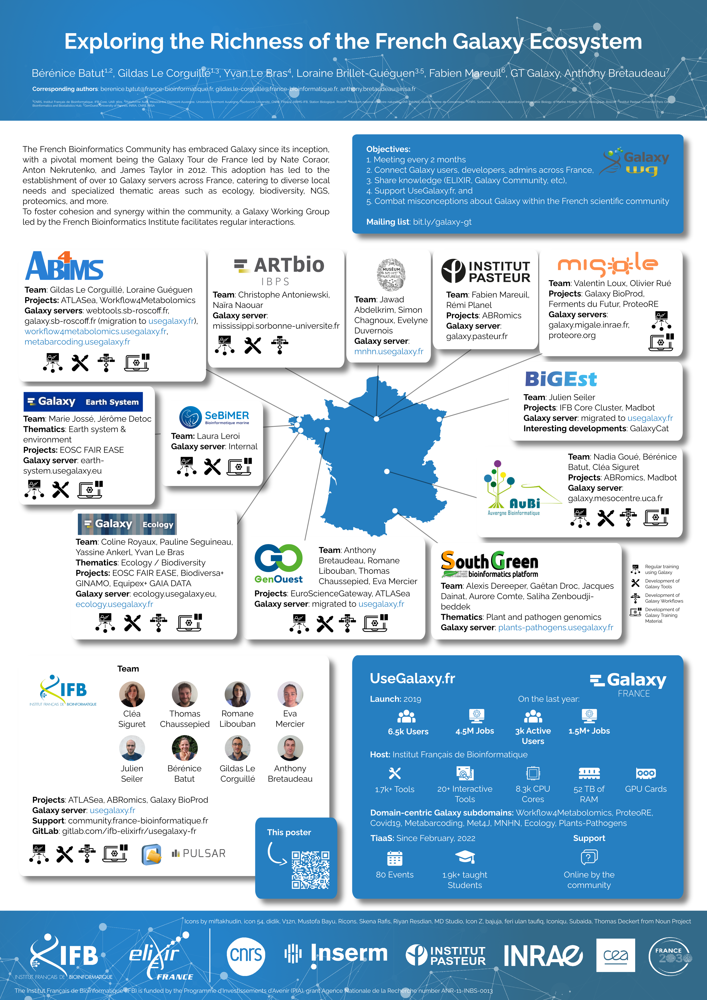

Exploring the Richness of the French Galaxy Ecosystem
=====================================================

### Bérénice Batut, Gildas Le Corguillé, Yvan Le Bras, Loraine Brillet-Guéguen, Fabien Mareuil, GT Galaxy, Anthony Bretaudeau

*Poster presented at [Galaxy Community Conference 2024](https://galaxyproject.org/events/gcc2024/)*

## Abstract

The French Bioinformatics Community has embraced Galaxy since its inception, with a pivotal moment being the Galaxy Tour de France led by Nate Coroar, Anton Nekrutenko, and James Taylor in 2012. This adoption has led to the establishment of over 10 Galaxy servers across France, catering to diverse local needs and specialized thematic areas such as ecology, biodiversity, NGS, proteomics, and more.

Among these servers, UseGalaxy.fr stands out as the flagship national instance, launched in 2021 and hosted by the French Institute for Bioinformatics (IFB - ELIXIR-FR). With robust infrastructure boasting 8300 CPU cores, 52 TB of RAM, and GPU cards, UseGalaxy.fr offers a comprehensive suite of over 3,000 tools, including interactive options like Jupyter Notebook, AlphaFold, and Helixer. Notably, it has garnered over 6,000 users who have collectively executed over 3.6 million jobs. Moreover, UseGalaxy.fr hosts specialized subdomains catering to various community needs, such as ecology, metabarcoding, and COVID-19 research, with ongoing integration of new subdomains.

The community's commitment to collaboration and consolidation is evident as several local servers have migrated to UseGalaxy.fr in recent years, with others expressing interest in doing the same. The French Galaxy community is deeply engaged in a multitude of projects at national, European, and global levels, including EOSC FAIR EASE, EuroScienceGateway, ATLASea and ABRomics.

To foster cohesion and synergy within the community, a Galaxy Working Group led by the French Bioinformatics Institute facilitates regular interactions. This group serves to connect Galaxy users across France, share knowledge, support UseGalaxy.fr, and combat misconceptions about Galaxy within the French scientific community.
In this poster presentation, we will provide an overview of the dynamic French Galaxy ecosystem, highlighting its diverse servers, engaged researchers, ongoing projects, and collaborative efforts. Through this exploration, we aim to showcase the vibrancy and impact of Galaxy within the French bioinformatics landscape.

## Poster

