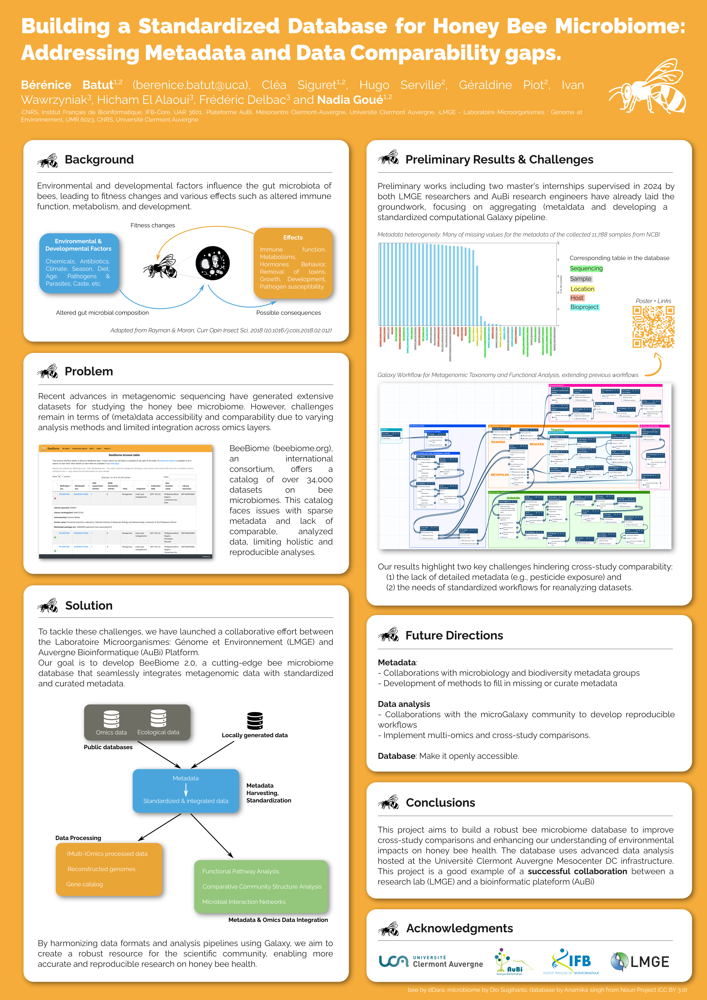

Building a Standardized Database for Honey Bee Microbiome: Addressing Metadata and Data Comparability gaps.
===========================================================================================================

### Bérénice Batut, Cléa Siguret, Hugo Serville, Géraldine Piot, Ivan Wawrzyniak, Hicham El Alaoui, Frédéric Delbac and Nadia Goué

*Poster presented at [JOBIM](https://jobim2025.labri.fr/)*

## Abstract

**Background**: Recent advances in metagenomic sequencing have generated extensive datasets for studying the honey bee microbiome. However, challenges remain in terms of data accessibility and comparability due to varying analysis methods and limited integration across omics layers. Additionally, the absence of metadata and its heterogeneity further complicate efforts to standardize and integrate these datasets. BeeBiome [1], an international consortium, has cataloged over 34,000 datasets on bee microbiomes, but faces issues with sparse metadata and lack of comparable, analyzed data, limiting holistic and reproducible analyses. This gap restricts data reusability and our understanding of how environmental factors, such as pesticides and climate conditions, influence microbiome dynamics.

**Results**: To address these challenges, we have initiated the development of BeeBiome 2.0, a standardized, publicly accessible bee microbiome database integrating metagenomic data with standardized and curated metadata. Considering the automation of data and associated metadata queries from NCBI, ENA, and BeeBiome, this database will enable real-time queries and visualizations to assess the impacts of biotic (pathogens, parasites) and abiotic (pesticides, pollutants) stressors on bee health. Preliminary works including three master's internships have already laid the groundwork, focusing on aggregating (meta)data and developing standardized computational Galaxy pipelines. Our  results highlight two key challenges: (1) the lack of detailed metadata (e.g., pesticide exposure) and (2) the absence of standardized workflows for reanalyzing datasets, hindering cross-study comparability.

**Conclusions**: This project aims to build a robust bee microbiome database using advanced data analysis hosted in a Mesocenter DC infrastructure. Ongoing collaborations with microbiology and biodiversity metadata groups and the microGalaxy community will address metadata and workflow gaps, improving cross-study comparisons and enhancing our understanding of environmental impacts on honey bee health.

## Useful links

- [BeeBiome](https://beebiome.org/)
- [Galaxy Workflow for Metagenomic Taxonomy and Functional Analysis](https://usegalaxy.eu/u/berenice/w/metagenomicstaxonomyfunctionalanalysis)
- [GitLab repository](https://git.mesocentre.uca.fr/galaxy.mesocentre.uca/bee-microbiome-db)

## Poster

