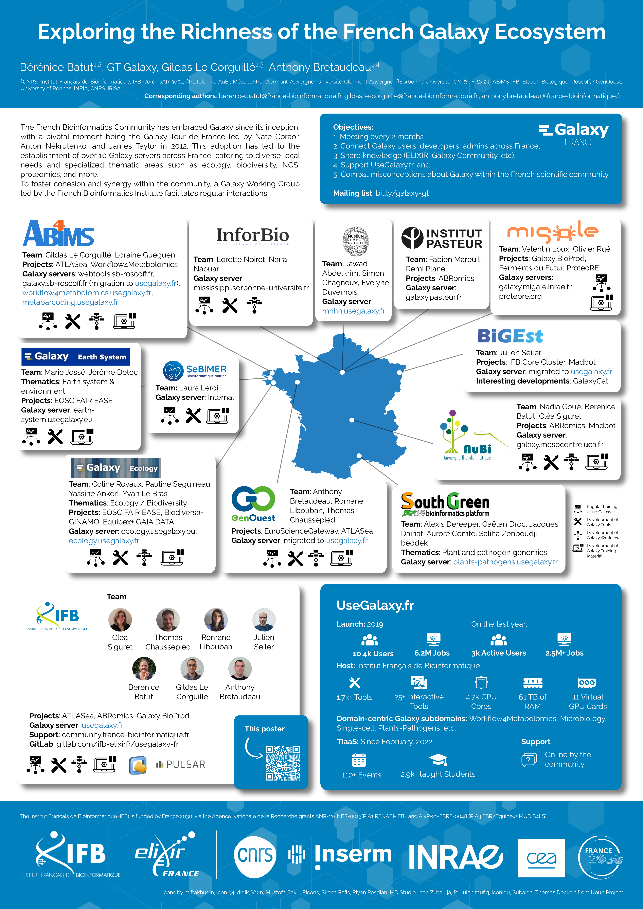

Exploring the Richness of the French Galaxy Ecosystem
=====================================================

### Bérénice Batut, GT Galaxy, Gildas Le Corguillé, Anthony Bretaudeau

*Poster presented at [JOBIM](https://jobim2025.labri.fr/)*

## Abstract

**Background**: The French bioinformatics community has actively embraced Galaxy(1) since its inception, with a pivotal moment being the Galaxy Tour de France in 2012, led by Nate Coroar, Anton Nekrutenko, and James Taylor. This adoption has led to the establishment of 10+ Galaxy servers across France, supporting diverse research areas such as ecology, biodiversity, HTS, and proteomics.

**Results**: Among these, UseGalaxy.fr stands out as the national flagship instance, launched in 2021 and hosted by the French Institute for Bioinformatics (IFB). It provides robust infrastructure (8,300 CPU cores, 52 TB RAM, GPUs) and offers 3,000+ tools, including Jupyter Notebook, AlphaFold, and Helixer. With 9,000+ users and 5.0M+ jobs executed, it has become a central hub for Galaxy users. Additionally, specialized subdomains (e.g., microbiology, ecology, metabolomics, plants) are continuously expanding.

Collaboration within the French Galaxy community is growing, with several local servers migrating to UseGalaxy.fr and more considering integration. The community actively contributes to national and international projects, including EOSC FAIR EASE, EOSC EuroScienceGateway, ATLASea, and ABRomics.  

To strengthen coordination, the Galaxy Working Group at the IFB fosters knowledge exchange, supports UseGalaxy.fr, and addresses misconceptions about Galaxy in France.

**Conclusions**: The French Galaxy ecosystem is a dynamic, collaborative network driving innovation in bioinformatics. This poster will showcase its infrastructure, engaged researchers, and ongoing projects, highlighting its impact within the national and international scientific community.

## Poster

