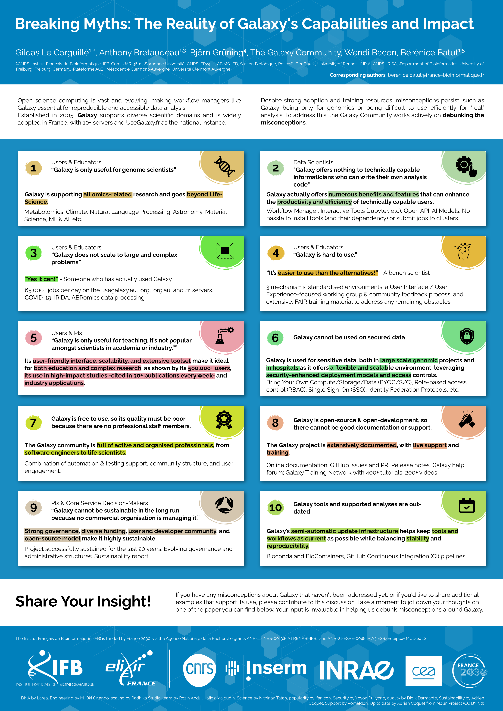

Breaking Myths: The Reality of Galaxy's Capabilities and Impact
===============================================================

### Gildas Le Corguillé, Anthony Bretaudeau, Björn Grüning, GT Galaxy, Bérénice Batut

*Poster presented at [JOBIM](https://jobim2025.labri.fr/)*

## Abstract

**Background**: Open science computing is vast and evolving, making workflow managers like Galaxy essential for reproducible and accessible data analysis. Established in 2005, Galaxy supports diverse scientific domains and is widely adopted in France, with 10+ servers and UseGalaxy.fr as the national instance. Despite strong adoption and training resources, misconceptions persist, such as Galaxy being only for genomics or being difficult to use efficiently for "real" analysis. To address this, the Galaxy Community works actively on debunking the misconception.

**Results**: Contrary to the belief that it is limited to genomics, UseGalaxy.fr offers 3,000+ tools across diverse fields like metabolomics, machine learning, and ecology. It also scales to complex analyses, supporting large projects like ABRomics and EOSC EuroScienceGateway. For advanced users, Galaxy provides FAIR-compliant workflows, including 100+ standardized workflows, an open API, and interactive tools like Jupyter Notebook, RStudio, OpenRefine. Usability has improved, e.g. with a new workflow editor and workflow annotations, making Galaxy more intuitive. Additionally, over 500 training materials offered with the Galaxy Training Network (GTN) demonstrate a strong training support for learners. Galaxy is widely used in research, cited in 30+ publications every week, and central to projects like the Earth Biogenome Project. Sustainability concerns are unfounded— UseGalaxy.fr is backed by Institut Français de Bioinformatique (IFB), maintained by dedicated staff, and updated weekly. Community support is strong, with several IFB members assisting users. 

**Conclusions**: Misconceptions about Galaxy's scalability, usability, and sustainability persist, but the community works to highlight its broad adoption, cutting-edge capabilities, and vital role in open science.

## Poster

