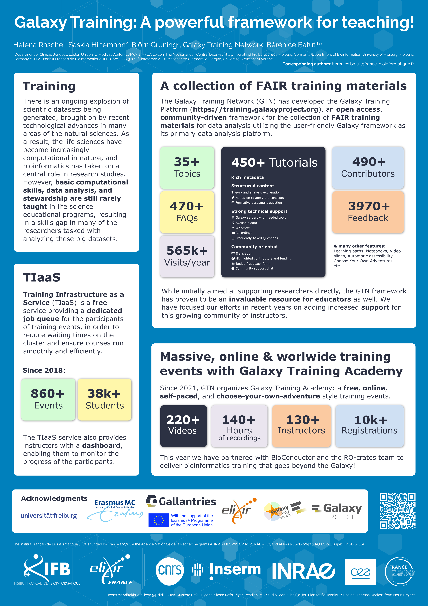

Galaxy Training: A powerful framework for teaching!
===================================================

### Helena Rasche, Saskia Hiltemann , Björn Grüning, Galaxy Training Network, Bérénice Batut

*Poster presented at [JOBIM](https://jobim2025.labri.fr/)*

## Abstract

**Background**: Advances in technology have led to an explosion of scientific data, making computational skills essential in life sciences. However, many researchers lack formal training in data analysis and stewardship, creating a significant skills gap.

**Results**: To bridge this gap, the Galaxy Training Network (GTN) developed the Galaxy Training Platform (https://training.galaxyproject.org), an open, community-driven repository of FAIR training materials centered on the Galaxy framework (3). The platform has grown rapidly, now offering 450+ tutorials, 135+ hours of captioned videos, and contributions from 450+ community members. Its materials have been widely used in training events, including the Galaxy Training Academy’s large-scale online sessions, which have attracted 10k+ registrations across four editions.

**Conclusions**: Initially designed to support researchers, the GTN has become an invaluable resource for educators. Recent efforts have enhanced support for instructors through new classroom-friendly features, streamlined content contributions, and dedicated train-the-trainer lessons.

## Useful links

- [Galaxy Training Network](https://training.galaxyproject.org)
    - [Learning Pathways](https://training.galaxyproject.org/training-material/learning-pathways/)
    - [Paper "Galaxy Training: A powerful framework for teaching!"](https://journals.plos.org/ploscompbiol/article?id=10.1371/journal.pcbi.1010752)
- Training Infrastructure as a Service
    - [On Galaxy France](https://usegalaxy.fr/tiaas/)
    - [On Galaxy Europe](https://usegalaxy.eu/tiaas/)
    - [On Galaxy Org](https://usegalaxy.org/tiaas/)
    - [On Galaxy Australia](https://usegalaxy.org.au/tiaas/)
- Galaxy Training Academy / GTN Smörgåsbord
    - [Galaxy Training Academy 2025](https://training.galaxyproject.org/training-material/events/2025-05-12-galaxy-academy-2025.html)
    - [Galaxy Training Academy 2024](https://training.galaxyproject.org/training-material/events/galaxy-academy-2024.html)
    - [GTN Smörgåsbord 2023](https://gallantries.github.io/video-library/events/smorgasbord3/)
    - [GTN Smörgåsbord 2022](https://gallantries.github.io/video-library/events/smorgasbord2/tapas.html)
- [Galaxy Community Hub](https://galaxyproject.org/)
- [Gallantries](https://gallantries.github.io/)
- Social media
    - Bluesky
        - [@galaxyproject.bsky.social](https://bsky.app/profile/galaxyproject.bsky.social)
        - [@galaxytraining.bsky.social](https://bsky.app/profile/galaxytraining.bsky.social)
    - LinkedIn
        - [Galaxy Project](https://www.linkedin.com/company/galaxy-project/)
    - Mastodon
        - [@galaxyproject@mstdn.science](https://mstdn.science/@galaxyproject)
        - [@gtn@mstdn.science](https://mstdn.science/@gtn)
        - [@gallantries@mstdn.science](https://mstdn.science/@gallantries)

## Poster

