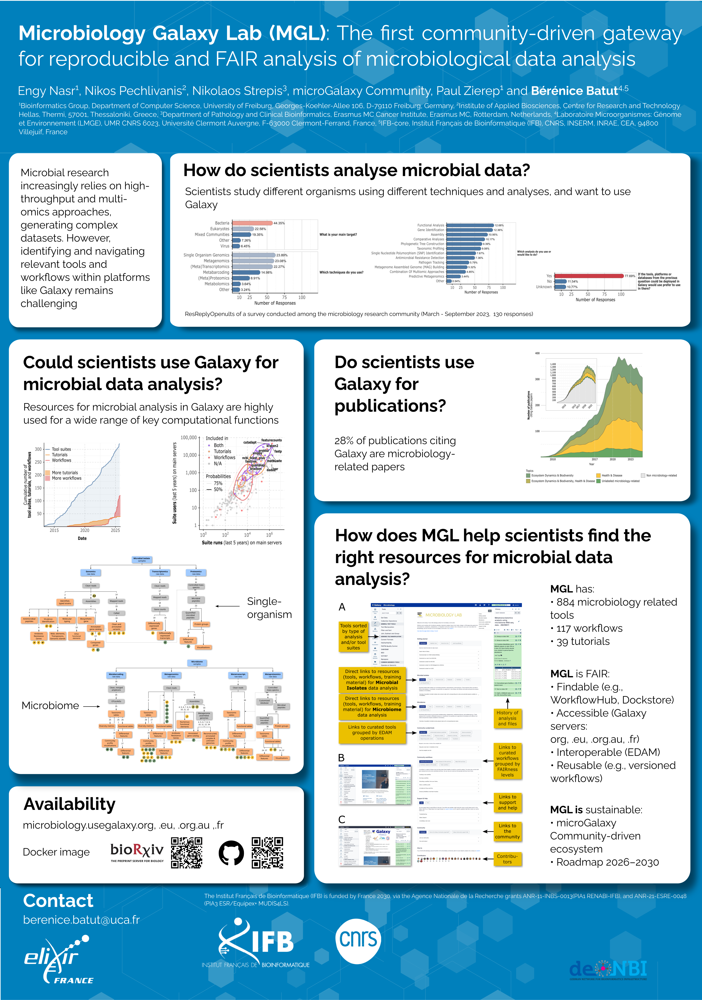

Contributing to ELIXIR All Hands Meeting 2026 poster session
============================================================

### Engy Nasr, Nikos Pechlivanis, Nikolaos Strepis, microGalaxy Community, Paul Zierep, and Bérénice Batut

*Poster presented at [ELIXIR All Hands Meeting 2026](https://elixir-events.eventscase.com/EN/ahm2026)*

## Abstract

The explosion of microbial omics data has outpaced the ability of many researchers to analyse it, with complex tools and limited computational resources creating barriers to discovery.

To address this gap, we present the Microbiology Galaxy Lab (MGL): a free, globally accessible, community-supported platform that combines state-of-the-art analytical power with user-friendly accessibility. Supported by the Galaxy and global microbiology communities, this platform integrates over 315 tool suites and 115 curated workflows, enabling comprehensive metabarcoding, (meta)genomic, (meta)transcriptomic, and (meta)proteomic data analysis within a FAIR-aligned environment. It also supports research in the health and infectious disease sectors, as well as in environmental microbiology. The platform’s utility is exemplified through various use cases, including antimicrobial resistance tracking, biomarker prediction, microbiome classification, and functional annotation of key microbes. Built on reproducibility and community engagement, it supports the creation, sharing, and updating of best-practice workflows. Over 35 tutorials and learning paths empower scientists, fostering an ecosystem that keeps resources at the forefront of microbiological data analysis. The MGL enables collective analysis, democratising research, thereby accelerating discovery across the global microbiology community (microbiology.usegalaxy.org, .eu, .org.au, .fr).

## Poster

