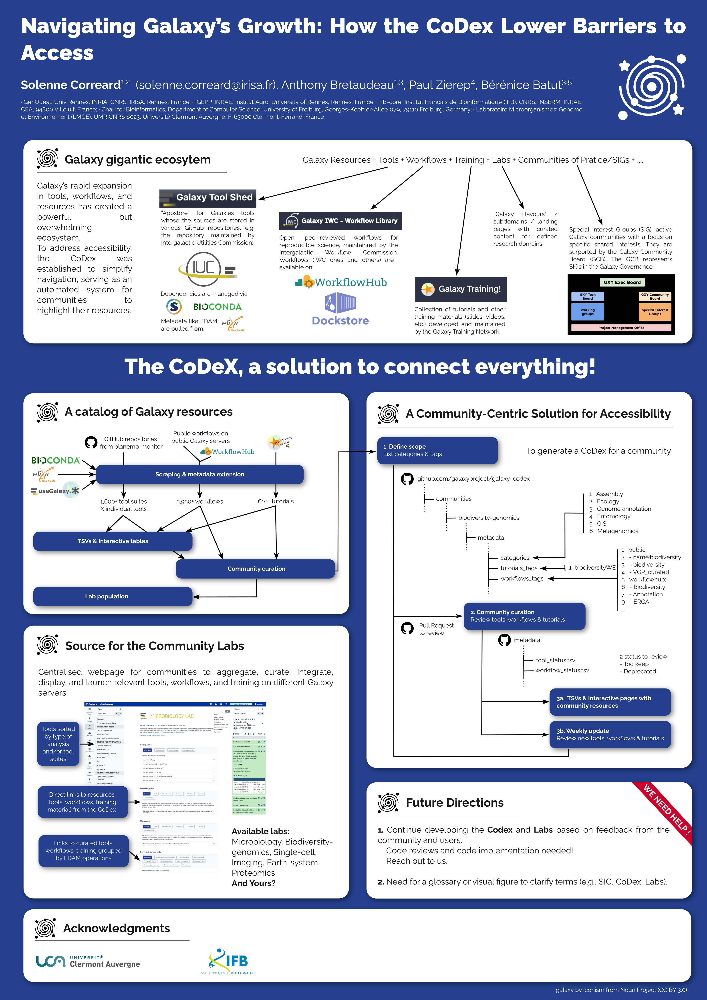

Navigating Galaxy’s Growth: How the CoDex Lowers Barriers to Access
===================================================================

### Solenne Correard, Anthony Bretaudeau, Paul Zierep, Bérénice Batut

*Poster presented at [Galaxy Community Conference 2026](https://galaxyproject.org/events/gcc2026/)*

## Abstract

## Useful links

Galaxy Codex:
- Catalogues
    - [Tools](https://galaxyproject.github.io/galaxy_codex/)
    - [Workflows](https://galaxyproject.github.io/galaxy_codex/workflows)
    - [Tutorials](https://galaxyproject.github.io/galaxy_codex/training)
- [GitHub repository](https://github.com/galaxyproject/galaxy_codex)
- [Matrix chat](https://matrix.to/#/!EybxPPvMQXtoiItzXG:matrix.org?via=matrix.org&via=gitter.im)

## Poster

